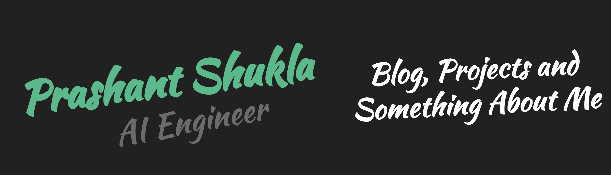

  

<h1 align="center">Hey 👋, I'm Prashant Shukla</h1>

  <b>AI/ML Engineer</b> &nbsp;|&nbsp; Agentic Systems &nbsp;|&nbsp; MLOps 
  Building production AI systems with advanced RAG, observability and evaluation

  
  
  
  
  

---

## About

I am an AI Engineer building autonomous agents that are smarter than my last three Slack threads, working on production AI/ML systems. My focus is making advanced RAG and agentic pipelines observable, measurable and reliable.

- Building agentic systems with **LangChain**, **LangGraph** and **MCP**
- Tracing, evaluating and monitoring LLM applications with **LangSmith**, **Langfuse** and **Ragas**
- Applying probabilistic and Bayesian modelling to real-world decision problems
- Mentor and core team lead at **Innogeeks**, guiding junior students in machine learning
- **AWS Certified**: AI Practitioner and Machine Learning Engineer Associate

---

## Technical Stack

<table>
  <tr>
    <td width="180"><b>AI ML</b></td>
    <td>

    </td>
  </tr>
  <tr>
    <td width="180"><b>Agents &amp; GenAI</b></td>
    <td>

    </td>
  </tr>
  <tr>
    <td width="180"><b>Observability &amp; Evaluation</b></td>
    <td>

    </td>
  </tr>
  <tr>
    <td width="180"><b>MLOps &amp; Cloud</b></td>
    <td>

    </td>
  </tr>
  <tr>
    <td width="180"><b>Backend &amp; Data</b></td>
    <td>

    </td>
  </tr>
  <tr>
    <td width="180"><b>Frontend</b></td>
    <td>

    </td>
  </tr>
</table>

---

## Selected Projects

| Project | Description | Stack |
|:--|:--|:--|
| [**Patent Gap Finder**](https://github.com/prashantshukla01/Patent-Gap-Finder_MCP) | 9-tool MCP server for patent analysis: claim extraction, IPC/CPC classification and prior-art search | FastMCP, Qdrant, Redis, Docker |
| **Papeer** | Agentic RAG chatbot with multi-session memory, ArXiv/URL/PDF ingestion and a claim-verification pipeline | LangGraph, LangChain, Qdrant, Streamlit |
| [**Recovery Decision Engine**](https://github.com/prashantshukla01/Recovery-Decision-Engine) ([demo](https://recovery-decision-engine-00.streamlit.app)) | Calibrated Bayesian engine for recovering failed subscription payments | PyMC, Streamlit |

---

## GitHub Activity

  
  

---

## Contact

I'm open to AI/ML engineering roles and to collaborating on agentic AI, RAG evaluation and MCP tooling.

- Email: [prashantshukla9812@gmail.com](mailto:prashantshukla9812@gmail.com)
- LinkedIn: [prashant-shukla](https://www.linkedin.com/in/prashant-shukla-36805a280/)

  

